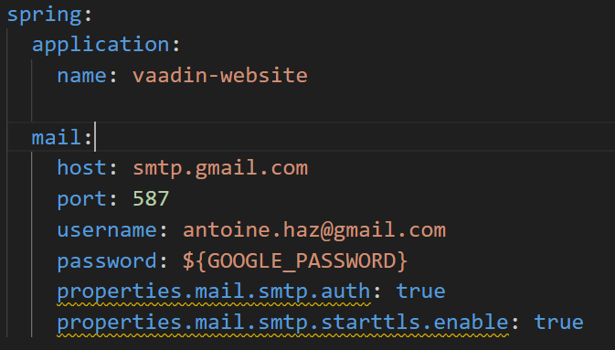

# Portfolio

### Run locally

The project emailing requires a google account set up to send emails via an app password.



set the username property
set the GOOGLE_PASSWORD environment variable

```bash
mvn clean spring-boot:run
```

### Production infrastructure

[https://dashboard.heroku.com/apps/vaadin-website](https://dashboard.heroku.com/apps/vaadin-website)